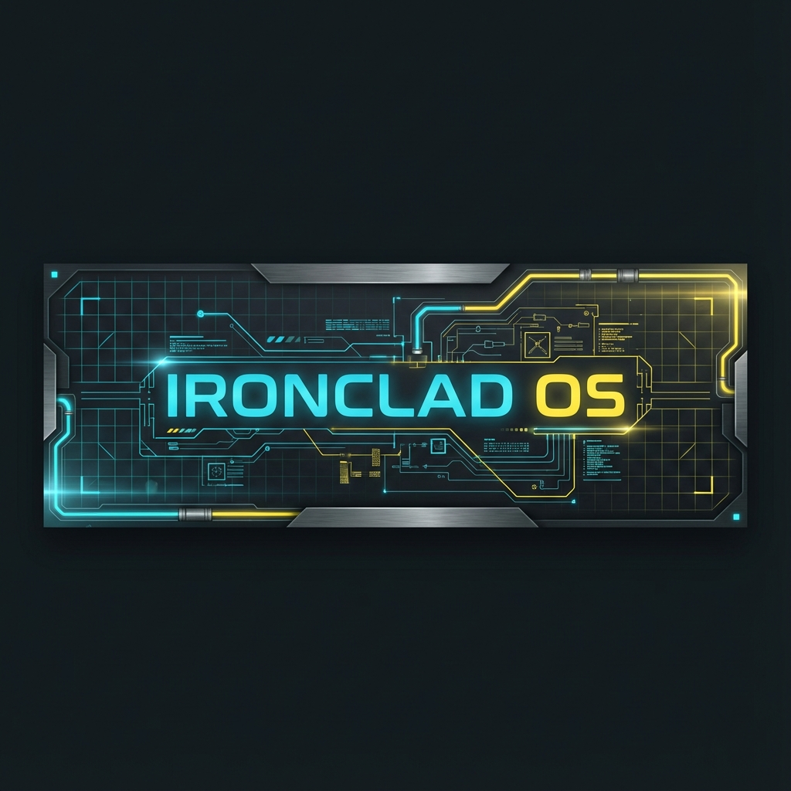

# Ironclad OS



> **Transform Ideas into Production Code.**  
> A deterministic, AI-powered software development platform that generates verifiable PRDs, Architecture diagrams, and code artifacts from natural language.

---

## 🚀 Features

- **WebAssembly Core**: Zero-latency, client-side logic execution using Rust/WASM.
- **100% Deterministic**: No hallucinations. The same input always produces the same output.
- **Industrial Minimal Design**: A premium, distraction-free interface built for engineers.
- **Comprehensive Artifacts**:
  - 📄 **PRD**: Product Requirements Documents
  - 🏗️ **ARD**: Architecture Requirements Documents
  - 📋 **Task Lists**: Jira-style breakdown
  - 🤖 **Agent Rules**: Cursor/Windsurf compatible instructions

## 🛠️ Tech Stack

- **Frontend**: React, TypeScript, Vite, Tailwind CSS
- **Core Logic**: Rust, WebAssembly (wasm-bindgen)
- **Styling**: Custom "Industrial Minimal" Design System
- **Animation**: Framer Motion

## 📦 Installation

1. **Clone the repository**

   ```bash
   git clone https://github.com/salvadalba/nodaysidle-ironclados.git
   cd nodaysidle-ironclados
   ```

2. **Install Frontend Dependencies**

   ```bash
   cd frontend
   npm install
   ```

3. **Build WASM Module** (Requires Rust toolchain)

   ```bash
   cd ../wasm
   wasm-pack build --target web
   ```

4. **Run Development Server**

   ```bash
   cd ../frontend
   npm run dev
   ```

## 📸 Screenshots

| Landing Page | Demo Engine |
|:---:|:---:|
|  |  |

## 🤝 Contributing

We welcome contributions! Please fork the repository and submit a Pull Request.

## 📄 License

MIT License © 2025 Ironclad OS
